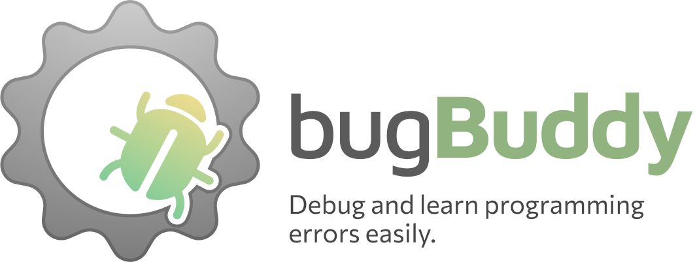

> [!IMPORTANT]
> What you are seeing here is an in-progress implementation of our thesis paper. While you are free to use this, it remains unanswered if this is effective while no testing has been conducted yet.



BugBuddy is a tool for making programming errors less scary and more friendly, making debugging more easy-to-learn. Powered by [ErrgoEngine](https://github.com/nedpals/errgoengine).

## Features
- Translates programming errors into human-readable messages
- Provides a run command to execute the current file in BugBuddy
- Supports multiple programming languages
- Supports multiple text editors / IDEs (via Language Server Protocol)

## Usage
To use BugBuddy, a program should be running on top of it. With that, you may use the `bugbuddy --` command:
```bash
# Syntax
$ bugbuddy -- <command [ARGS]>

# Example for java
$ bugbuddy -- java HelloWorld

# Example for python
$ bugbuddy -- python hello_world.py

# Example for programs compiled in compiled languages (eg. C, C++, C#, Go, etc.)
$ bugbuddy -- ./hello_world
$ bugbuddy -- ./hello_world.exe # For Windows users
```

The `bugbuddy --` is also useful during compilation! Simply append `bugbuddy --` to your compiler:
```bash
# This will capture the compiler error/s from your Java compiler (javac)
$ bugbuddy -- javac HelloWorld.java
```

To be able to see the enhanced errors, a BugBuddy extension should be installed in your text editor / IDE:
- VSCode: [vscode-bugbuddy](https://marketplace.visualstudio.com/items?itemName=nedpals.bugbuddy)
- NetBeans: nb-bugbuddy (link soon)

> [!NOTE]
> BugBuddy implements the Language Server Protocol (LSP) so any LSP-supported text editor / IDE is also supported.
> However, you will have a reduced experience as it implements additional features outside the LSP spec that your editor
> might not support of.
> If you still want to use it, simply connect the `bugbuddy lsp` command to your editor.

## Paper
- TODO

## Copyright and license
(c) 2023 by the [BugBuddy / ErrgoEngine Authors](https://github.com/nedpals/bugbuddy/graphs/contributors). Code released under the [MIT License](https://github.com/nedpals/bugbuddy/blob/main/LICENSE).
