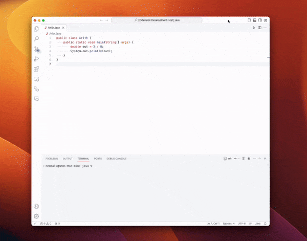

# vscode-bugbuddy

Official VSCode client extension for BugBuddy. BugBuddy is a tool for translating programming errors into human-readable messages. It is designed to help beginners understand the errors they encounter while learning to code.

## Features

This extension allows you to interact with BugBuddy directly from VSCode. It will receive translated error outputs from BugBuddy and display them in the editor. It also provides a run command to execute the current file in BugBuddy.

## Requirements

This extension requires that BugBuddy is installed and running on your machine. To install BugBuddy, please visit the [release page](https://github.com/nedpals/bugbuddy/releases) and download the latest release.

## Extension Settings

This extension contributes the following settings:

* `bugbuddy.path`: Path to the BugBuddy server.
* `bugbuddy.dataDirPath`: Path to the BugBuddy data directory.
* `bugbuddy.daemonPort`: Port to connect to the BugBuddy daemon server.

## Release Notes

### 0.2.0

- Add ability to get/set BugBuddy data directory.
- Add ability to connect to a BugBuddy daemon server with a custom port.

### 0.1.0

- Initial release
